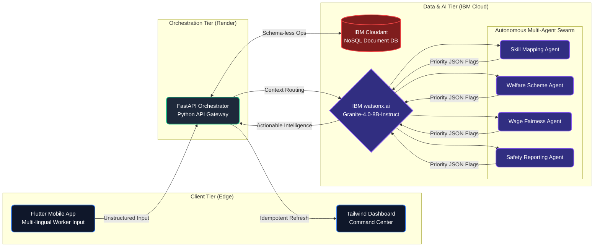

  
  # 🚧 कारीGAR APP
  **Smart Migrant Labor Welfare Platform**
  
  *An Agentic AI ecosystem designed to safeguard interstate migrant workers by automating welfare eligibility mapping, wage fairness auditing, and hazard detection. Built for the IBM University Engagement Project.*
  

---

## 📖 System Overview

Gujarat hosts a massive interstate migrant workforce across construction, textiles, and chemical processing. The **Karigar App** bridges the critical gap between vulnerable workers and government welfare schemes (e.g., BOCW, PM-SYM) utilizing a highly scalable, multi-agent AI architecture. 

> **The Agentic Advantage:** Rather than relying on a passive chatbot, the system utilizes specialized IBM Granite AI agents to actively extract artisan skills, audit statutory wage compliance, and autonomously escalate critical safety hazards to a real-time command center.

## 🏛️ Core Architecture

Our platform utilizes a dual-tier edge approach: a Flutter mobile application for raw data collection, securely routed through a custom FastAPI orchestrator, and deeply integrated with IBM Cloud services for AI processing and schema-less data storage.

## 🛠️ Technology Stack

| Domain | Technologies Used |
| :--- | :--- |
| **AI Infrastructure** | `IBM watsonx.ai`, `IBM Granite-4.0-8B-Instruct` |
| **Database** | `IBM Cloudant` *(NoSQL Document Database)* |
| **Backend Orchestration** | `Python`, `FastAPI`, `Render Cloud` |
| **Frontend (Mobile Edge)** | `Flutter`, `Dart` *(Release APK)* |
| **Frontend (Command Center)**| `HTML5`, `Tailwind CSS`, `Vanilla JS` |

## 🌐 Live System Access

**[🚀 Access Live Command Center Dashboard](https://team-thekedaars-karigar.onrender.com/dashboard)**

> **System Note:** The dashboard updates asynchronously in real-time as incoming grievances are processed, analyzed, and flagged by the autonomous AI agents.

## 👥 Team Thekedaars

| Team Member | Engineering Role |
| :--- | :--- |
| **Anurrag Singh Tomar** | Team Leader & Lead Architecture Engineer |
| **Prasiddhi Mishra** | Lead Frontend Developer & UI/UX Designer |
| **Krish Singh** | Backend Systems & API Integrations Developer |
| **Shrihari H Kulkarni** | Cloud Database & Infrastructure Engineer |
